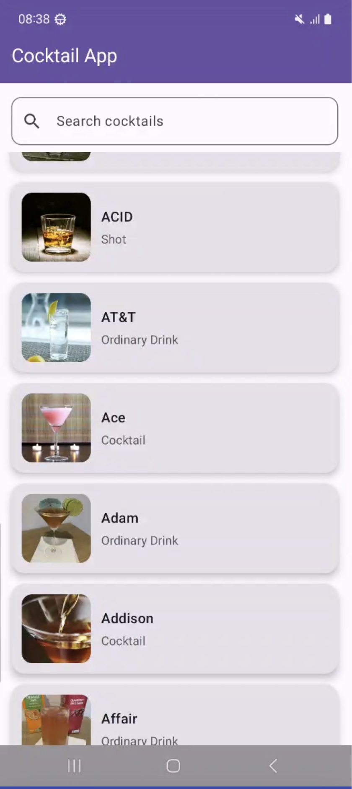

# 🍸 Cocktail App

A simple Android application built with **Jetpack Compose** and **Room Database** that allows users to search and view cocktail details.
This project demonstrates the use of **MVVM architecture**, **Navigation Compose**, **Hilt**, **Retrofit**, **OkHttp**, and **Room for local persistence**.

This app for to make simple android application, using free [CockTailDB API](https://www.thecocktaildb.com/api.php).

---

## ✨ Features
- Search cocktails by name
- View cocktail details
- Save last search keyword locally
- Clear search field with one click
- Elegant UI using Material 3 and Jetpack Compose

---

## 📦 Tech Stack
- [Kotlin](https://kotlinlang.org/)
- [Jetpack Compose](https://developer.android.com/jetpack/compose)
- [Navigation Compose](https://developer.android.com/jetpack/compose/navigation)
- [Room Database](https://developer.android.com/training/data-storage/room)
- [Material 3](https://developer.android.com/jetpack/androidx/releases/compose-material3)

---

Download the APK from [here](https://drive.google.com/file/d/1U0lJqZUzxe8kcsXKyNbtXRoiQvA_EZtL/view?usp=sharing)

<h2 align="center"><b>Demo:</b></h2>
Demo Video <a href="https://drive.google.com/file/d/1FKBte7dbiua8fa0IZgaQVssEiFIWLkcd/view?usp=sharing">here</a> or click the image below:<br>
<a href="https://drive.google.com/file/d/1FKBte7dbiua8fa0IZgaQVssEiFIWLkcd/view?usp=sharing">
  
</a>

---

## 🚀 Installation

### 1. Clone the repository
```bash
git clone https://github.com/faridsavarudin/cocktail-app.git
cd TestGenciDev